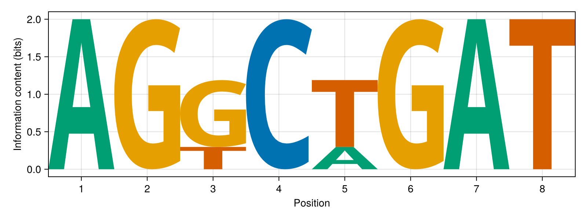

# MakieSequenceLogos.jl

[](https://cossio.github.io/MakieSequenceLogos.jl/stable)
[](https://cossio.github.io/MakieSequenceLogos.jl/dev)

A Julia package to plot [sequence logos](https://en.wikipedia.org/wiki/Sequence_logo) with [Makie](https://docs.makie.org/stable/).



MakieSequenceLogos.jl can:

- build logos directly from aligned DNA, RNA, or protein sequences
- compute count, probability, weight, and information-content matrices
- render logos from custom matrices using Makie figures and axes

See the [stable documentation](https://cossio.github.io/MakieSequenceLogos.jl/stable), the [development documentation](https://cossio.github.io/MakieSequenceLogos.jl/dev), or the runnable [demo.jl](https://github.com/cossio/MakieSequenceLogos.jl/blob/main/repl/demo.jl).

## Installation

This package is registered. Install it with:

```julia
using Pkg
Pkg.add("MakieSequenceLogos")
```

## Usage

### Build a logo from aligned sequences

```julia
using CairoMakie
using MakieSequenceLogos

sequences = [
    "AGGCTGAT",
    "AGGCTGAT",
    "AGTCTGAT",
    "AGGCAGAT",
]

fig = seqlogo(sequences; alphabet_name = :dna, matrix_type = :information)
save("dna_logo.png", fig)
```

### Build a logo from a custom matrix

```julia
using CairoMakie
using MakieSequenceLogos

alphabet = DNA_ALPHABET
matrix = [
    1.5  0.1  0.3  0.0  0.5;
    0.2  0.1  1.2  0.0  0.5;
    0.1  1.8  0.3  0.0  0.5;
    0.2  0.0  0.2  2.0  0.5;
]

fig = seqlogo(matrix, alphabet; color_scheme = :classic)
save("custom_logo.png", fig)
```

### Compute matrices without plotting

```julia
using MakieSequenceLogos

sequences = [
    "AGGCTGAT",
    "AGGCTGAT",
    "AGTCTGAT",
    "AGGCAGAT",
]

counts = pfm(sequences, DNA_ALPHABET)
probabilities = ppm(sequences, DNA_ALPHABET; pseudocount = 0.5)
weights = pwm(sequences, DNA_ALPHABET; pseudocount = 0.5)
bits = information_content(sequences, DNA_ALPHABET; pseudocount = 0.5)
```

## API summary

- `seqlogo`: render sequence logos from either precomputed matrices or aligned sequences
- `seqlogo!`: render sequence logos on an existing Makie axis from precomputed matrices only
- `pfm`, `ppm`, `pwm`, `information_content`: build common sequence-logo matrices
- `DNA_ALPHABET`, `RNA_ALPHABET`, `PROTEIN_ALPHABET`: built-in alphabets

## Related packages

In contrast to this package, which is a "native" Julia implementation based on Makie, the following packages require Python dependencies:

* https://github.com/cossio/Logomaker.jl - A thin Julia wrapper of the Logomaker Python package to plot sequence logos.
* https://github.com/cossio/SequenceLogos.jl - Implementation based on PyPlot.
